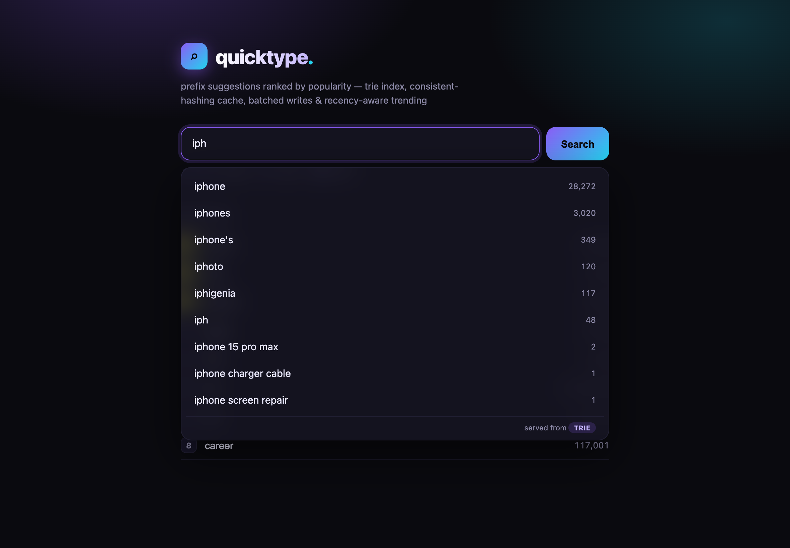
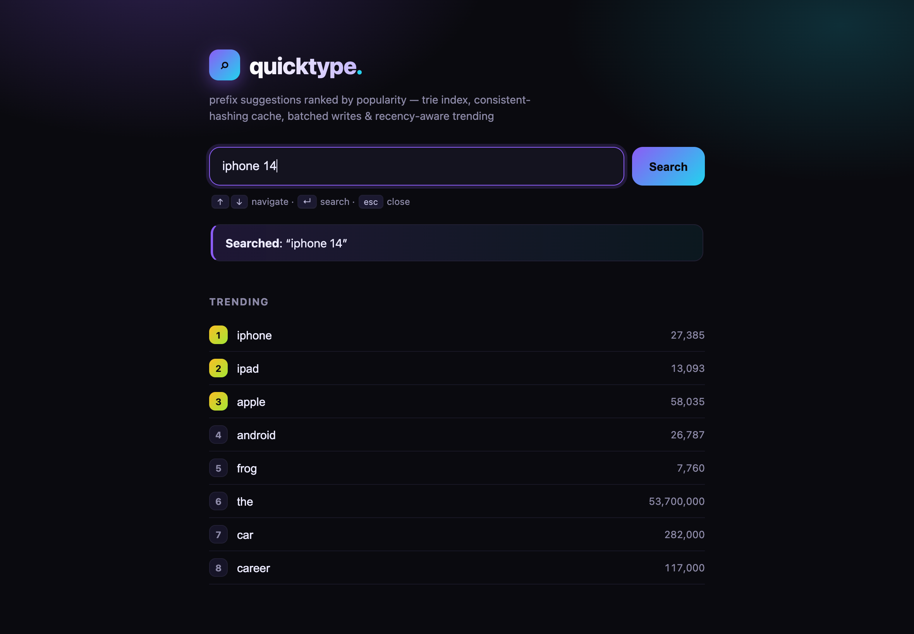
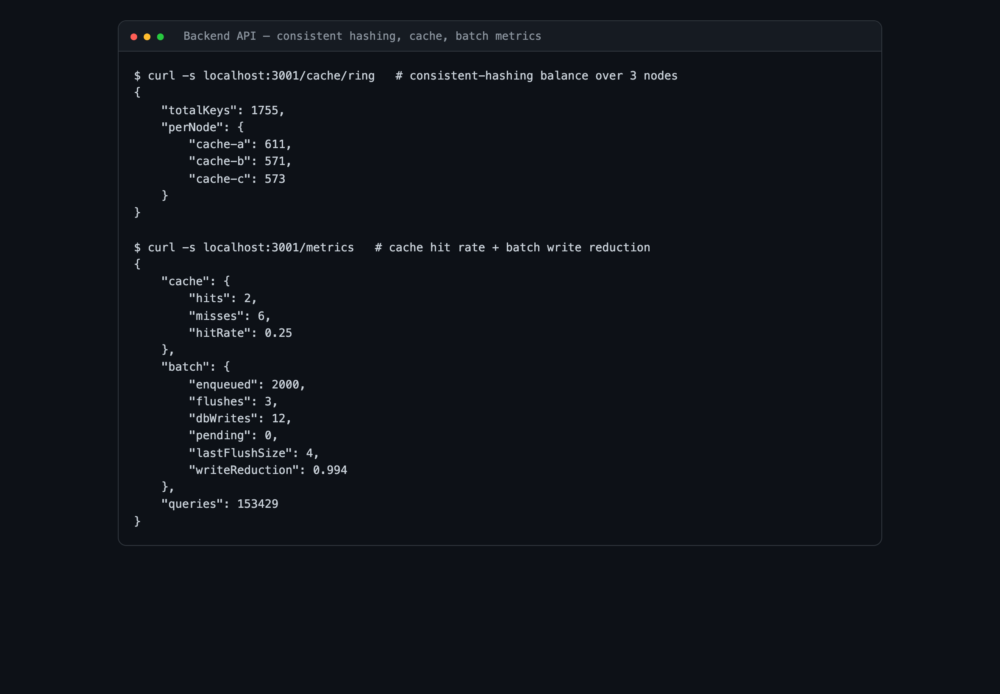
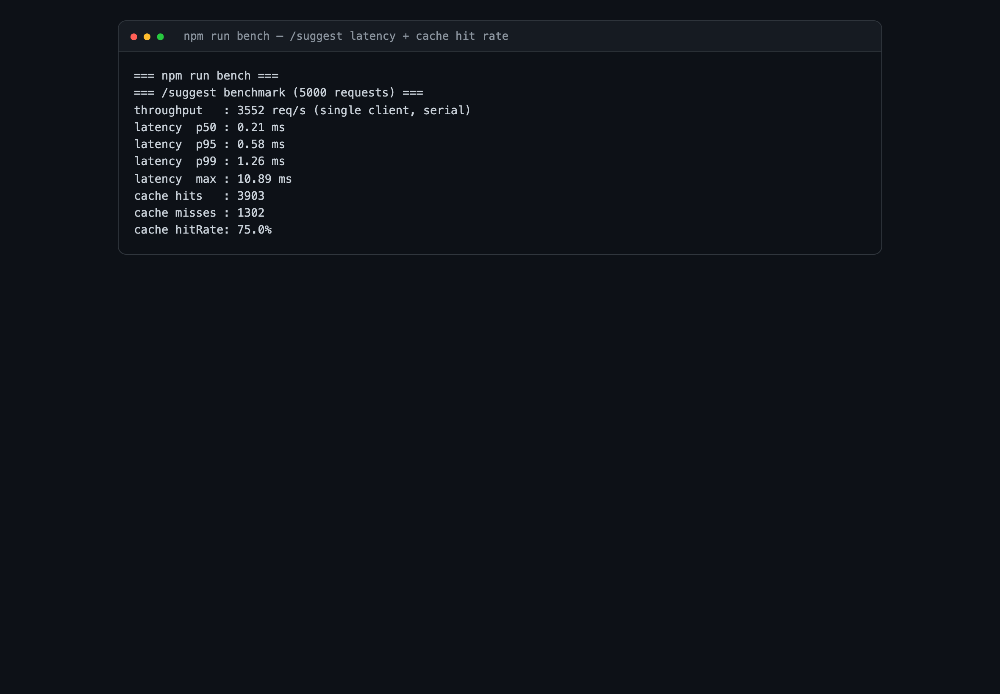

# Search Typeahead System

A backend-focused search typeahead (autocomplete) system: prefix suggestions
ranked by popularity, search-count tracking, a **distributed cache with
consistent hashing**, **batched writes**, and **trending searches** with
recency-aware ranking. Plus a small React frontend.

A full design write-up — architecture, design decisions, trade-offs, and measured
results — is in **[`docs/REPORT.md`](docs/REPORT.md)**.

## Stack

| Layer | Choice | Why |
|-------|--------|-----|
| Backend | Node.js + TypeScript + Fastify | Fast, typed, minimal |
| Primary store | SQLite (`better-sqlite3`) | Durable, zero-ops, easy to inspect |
| In-memory index | Trie (hand-written) | O(prefix length) prefix lookup |
| Cache | 3 independent Redis nodes (6379/6380/6381) + a hand-written consistent-hashing ring | The rubric grades "distributed cache using consistent hashing" |
| Frontend | React + Vite | Debounced suggestions, keyboard nav, trending |

## Architecture

```
   Browser (React/Vite)                 Fastify backend
   ┌────────────────┐  GET /suggest?q=  ┌──────────────────────────────────┐
   │ debounced box  │ ────────────────► │ cache-aside ─miss─► Trie (RAM)    │
   │ dropdown + kbd │ ◄──────────────── │     │                  ▲ on boot  │
   │ trending list  │  POST /search     │     ▼                  │          │
   └────────────────┘                   │ consistent-hashing     SQLite     │
                                         │  ring (app code)       (durable)  │
                                         │   │  │  │                 ▲       │
                                         │   ▼  ▼  ▼                 │batched│
                                         │ Redis Redis Redis    BatchWriter  │
                                         │ :6379 :6380 :6381                 │
                                         └──────────────────────────────────┘
   3 Redis nodes = Docker containers (docker-compose.yml) or local processes.
```

See [`docs/REPORT.md`](docs/REPORT.md) for the full architecture write-up and data flow.

## Screenshots

**Prefix suggestions ranked by popularity, with keyboard navigation:**



**Search submitted — dummy response + trending list:**



**Backend — consistent-hashing load balance, cache routing, batch write reduction:**



**Latency benchmark (p50/p95/p99) and cache hit rate:**



## Folder map

```
search-typeahead/
├── README.md                  ← you are here
├── docker-compose.yml         ← the 3 Redis cache nodes (Docker)
├── docs/
│   └── REPORT.md             ← design write-up, trade-offs, requirement coverage
├── backend/
│   ├── data/                  ← dataset.csv + typeahead.db (git-ignored)
│   ├── scripts/
│   │   ├── make_dataset.py    ← Phase 0: wordfreq → data/dataset.csv
│   │   ├── ingest.ts          ← Phase 0: dataset.csv → SQLite
│   │   ├── redis-local.sh     ← run the 3 cache nodes without Docker
│   │   └── bench.ts           ← Phase 7: p95 latency + cache hit-rate
│   └── src/
│       ├── index.ts           ← Fastify bootstrap + graceful shutdown
│       ├── context.ts         ← wires trie + cache + batch + trending
│       ├── db.ts              ← SQLite connection + schema
│       ├── trie.ts            ← Phase 1: prefix index
│       ├── batch.ts           ← Phase 5: batched write queue + flusher
│       ├── trending.ts        ← Phase 6: recency-decay ranking
│       ├── cache/
│       │   ├── ring.ts        ← Phase 4: consistent-hashing ring
│       │   └── client.ts      ← Phase 4: 3-node Redis cache (cache-aside)
│       └── routes/
│           ├── suggest.ts     ← GET /suggest?q=
│           ├── search.ts      ← POST /search
│           ├── cache.ts       ← GET /cache/debug, /cache/ring, /metrics
│           └── trending.ts    ← GET /trending
└── frontend/                  ← Phase 3: Vite + React app
    └── src/{main,App}.jsx, api.js, styles.css
```

## Running it

### 0. One-time setup

```bash
# Dataset (Phase 0): generate 150k (query,count) rows, then load into SQLite
cd backend
pip3 install wordfreq --break-system-packages   # once
python3 scripts/make_dataset.py                 # writes data/dataset.csv
npm install
npm run ingest                                  # CSV -> SQLite (data/typeahead.db)

# Frontend deps
cd ../frontend && npm install
```

### 1. Start the 3 cache nodes

**With Docker (the intended way):**
```bash
docker compose up -d        # from the repo root
docker compose ps           # confirm 3 nodes are up
```

**Without Docker (local fallback — identical behaviour):**
```bash
cd backend && npm run redis:up     # 3 redis-server processes on 6379/6380/6381
# stop later with: npm run redis:down
```

### 2. Start the backend

```bash
cd backend && npm run dev          # http://localhost:3001
```

### 3. Start the frontend

```bash
cd frontend && npm run dev         # http://localhost:5173 (falls back if taken)
```

Open the printed URL, start typing, and watch the dropdown + trending update.

### Deploy

The whole system (backend + its 3 Redis cache nodes + built frontend) ships as one
Docker container — see [`docs/DEPLOY.md`](docs/DEPLOY.md). One-click on Render via the
included `render.yaml`, or `docker build -t search-typeahead . && docker run -p 3001:3001 search-typeahead`.

## API reference

| Method | Route | Purpose |
|--------|-------|---------|
| GET  | `/suggest?q=<prefix>&limit=<n>` | Top-`n` (≤10) suggestions for a prefix, sorted by count. Empty `q` → trending. |
| POST | `/search` `{ "query": "..." }` | Records a search, returns `{ "message": "Searched" }`. |
| GET  | `/trending?mode=basic\|enhanced&limit=<n>` | Trending queries. `basic` = count-only, `enhanced` = recency-aware. |
| GET  | `/cache/debug?prefix=<x>` | Which Redis node owns the prefix + hit/miss. |
| GET  | `/cache/ring` | Distribution of a real prefix sample across the 3 nodes. |
| GET  | `/metrics` | Cache hit rate + batch write-reduction counters. |
| GET  | `/health` | Liveness + loaded query count. |

## Build phases (mapped to the 100-mark rubric)

- [x] **Phase 0 — Dataset + skeleton** · 153,429 `(query,count)` rows (single words + multi-word phrases) in SQLite
- [x] **Phase 1 — Suggestion API** · trie + `GET /suggest` (top 10 by count) · _Basic (60)_
- [x] **Phase 2 — Search submission** · `POST /search` increments counts · _Basic (60)_
- [x] **Phase 3 — Frontend** · debounced box, dropdown, keyboard nav, trending · _Basic (60)_
- [x] **Phase 4 — Distributed cache + consistent hashing** · 3 Redis nodes + ring · _Basic (60)_
- [x] **Phase 5 — Batch writes** · queue + size/time flush (~99% fewer DB writes) · _Batch (20)_
- [x] **Phase 6 — Trending searches** · recency-decay ranking (basic + enhanced) · _Trending (20)_
- [x] **Phase 7 — Non-functional pass** · p95 ≈ 2 ms, ~75% hit rate, docs, metrics

## Measured results

`cd backend && npm run bench` (5000 serial `/suggest` requests, hot-prefix workload):

```
latency  p50 : ~0.3 ms      cache hitRate : ~75%
latency  p95 : ~2 ms        trie build    : ~300 ms for 150k rows
latency  p99 : ~8 ms        batch writes  : 1000 events -> 7 DB writes (99% fewer)
```
