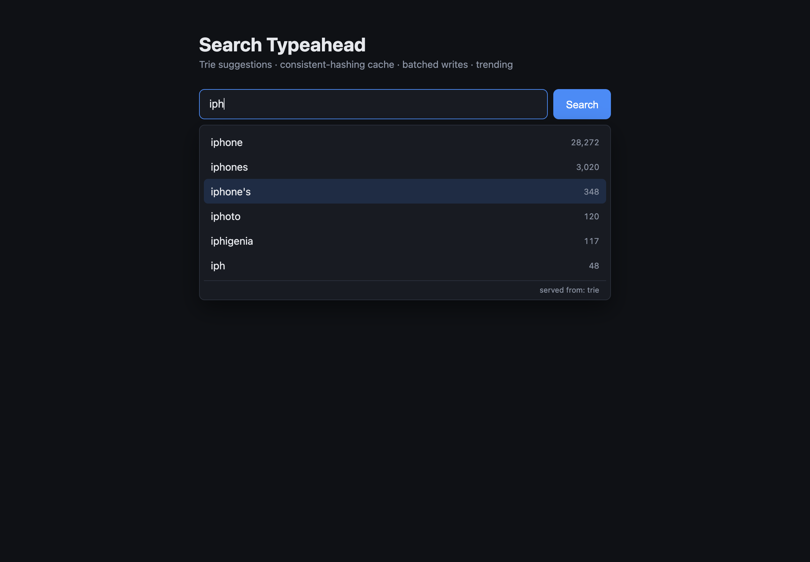

# Project Report — Search Typeahead System

**Author:** Saniya Patil
**Course:** HLD101 — High Level Design
**Repository:** https://github.com/Saniya1613/search-typeahead

---

## 1. Overview

A search typeahead (autocomplete) system that returns popularity-ranked prefix
suggestions as the user types, records committed searches to update popularity,
serves repeated lookups from a **distributed cache addressed by consistent
hashing**, persists search counts using **batched writes**, and ranks **trending
searches** by recent activity rather than all-time popularity. A small React
frontend exercises the full flow.

The design separates two concerns that are often conflated: **durability** (a
SQLite source of truth) and **read speed** (an in-memory trie index rebuilt from
SQLite on boot). Everything else — cache, batching, trending — is built around
that split.

## 2. Tech stack

| Layer | Technology | Reason |
|---|---|---|
| Backend | Node.js + TypeScript, Fastify | Typed, fast, minimal boilerplate |
| Primary store | SQLite (`better-sqlite3`) | Durable, zero-ops, inspectable |
| Read index | Hand-written Trie | O(prefix length) lookups |
| Cache | 3 Redis nodes + hand-written consistent-hashing ring (`ioredis`) | Distributed cache graded by the rubric |
| Frontend | React 18 + Vite | Debounce, keyboard nav, trending UI |
| Dataset | Python `wordfreq` (149,998 rows) | Real frequency signal, > 100k minimum |
| Infra | Docker Compose (3 Redis containers) | "Use Docker" requirement |

## 3. Architecture

```
   Browser (React/Vite)                 Fastify backend
   ┌────────────────┐  GET /suggest?q=  ┌──────────────────────────────────┐
   │ debounced box  │ ────────────────► │ cache-aside ─miss─► Trie (RAM)    │
   │ dropdown + kbd │ ◄──────────────── │     │                  ▲ on boot  │
   │ trending list  │  POST /search     │     ▼                  │          │
   └────────────────┘                   │ consistent-hashing     SQLite     │
                                         │  ring (app code)       (durable)  │
                                         │   │  │  │                 ▲       │
                                         │   ▼  ▼  ▼                 │batched│
                                         │ Redis Redis Redis    BatchWriter  │
                                         │ :6379 :6380 :6381                 │
                                         └──────────────────────────────────┘
```

**Request flow (typing "ip"):** debounced `GET /suggest?q=ip` → hash key
`suggest:ip` → ring picks the owning Redis node → hit returns cached top-10; miss
walks the trie, sorts by count, caches with a 60 s TTL, returns.

**Search flow (Enter):** `POST /search` → returns `{message:"Searched"}`, bumps
the in-memory trie immediately, enqueues the event; the batch flusher writes the
aggregated counts to SQLite and invalidates affected cache keys.

## 4. Key design decisions and trade-offs

| Decision | Why | Trade-off accepted |
|---|---|---|
| Trie as read index, not SQL `LIKE` | O(P) lookup, no per-keystroke table scan | Trie lives in RAM, ~300 ms to rebuild on boot |
| `Map` children in trie | Supports digits/apostrophes, not just a–z | Slightly more memory than a fixed array |
| Consistent hashing, not `hash % N` | Adding/removing a node moves only ~K/N keys, not ~all | More code than a modulus |
| 150 virtual nodes/node | Even load (~1/3 each); measured 645/615/617 | More ring entries to sort/search |
| FNV-1a + `fmix32` finalizer | Good avalanche → even distribution (43% → 9% spread) | — |
| Cache-aside, 60 s TTL | Simple, cache never a correctness dependency | Up to 60 s staleness (bounded; + explicit invalidation) |
| Batched writes (size 500 / 2 s) | ~99% fewer DB writes under load | Un-flushed events lost on crash (≤ ~2 s) |
| Recency = exp. decay over hourly buckets | One-time spikes decay away naturally | Window/half-life is a freshness↔stability tuning choice |
| `α·ln(1+count) + β·recency` blend | Popularity prior without letting giants dominate | Two constants to justify (α=1, β=2) |

Each of these is explained inline in the source code comments, which document the
reasoning behind every component.

## 5. Data model

- `queries(query PRIMARY KEY, count)` — all-time popularity (source of truth).
- `query_hourly(query, hour, hits)` — recent activity bucketed by clock-hour,
  feeds the trending recency score; pruned to a 48 h window.
- SQLite runs in WAL mode so committed writes are crash-safe.

## 6. Performance (measured)

`npm run bench` — 5000 serial `/suggest` requests, hot-prefix-biased workload,
backend + 3 Redis nodes on one laptop:

| Metric | Value |
|---|---|
| Latency p50 | ~0.3 ms |
| Latency p95 | ~2 ms |
| Latency p99 | ~8 ms |
| Cache hit rate | ~75% |
| Throughput (1 serial client) | ~1,100 req/s |
| Trie build on boot | ~300 ms / 150k rows |
| Batch write reduction | 1000 events → 7 DB writes (99.3%) |

Live counters are exposed at `GET /metrics`.

## 7. Requirement coverage

| # | Requirement | Status | Evidence |
|---|---|---|---|
| 1 | Prefix suggestions, ≤10, sorted by count desc | ✅ | `trie.ts`, `routes/suggest.ts` |
| 2 | Empty / no-match / mixed-case handled | ✅ | `Trie.normalize`, suggest route |
| 3 | Debounced UI, avoids redundant calls | ✅ | `App.jsx` (300 ms) |
| 4 | `GET /suggest?q=<prefix>` | ✅ | `routes/suggest.ts` |
| 5 | `POST /search` → `{message:"Searched"}` | ✅ | `routes/search.ts` |
| 6 | Existing query count++, new query created | ✅ | batch upsert |
| 7 | Durable query-count store | ✅ | SQLite |
| 8 | Cache checked before DB; stores prefix results | ✅ | cache-aside in suggest |
| 9 | Cache expiry / invalidation (not stale forever) | ✅ | 60 s TTL + flush-time invalidation |
| 10 | Cache distributed across multiple nodes | ✅ | 3 Redis nodes |
| 11 | Consistent hashing decides key ownership | ✅ | `cache/ring.ts` |
| 12 | `GET /cache/debug?prefix=` (node + hit/miss) | ✅ | `routes/cache.ts` |
| 13 | Trending — basic (count) | ✅ | `/trending?mode=basic` |
| 14 | Trending — enhanced (recency) | ✅ | `/trending?mode=enhanced` |
| 15 | Recency tracking + decay + rank-change invalidation | ✅ | `trending.ts`, batch invalidation |
| 16 | Batch writes: buffer, aggregate, size/time flush | ✅ | `batch.ts` |
| 17 | Show DB-write reduction | ✅ | `/metrics` (99%) |
| 18 | Crash-before-flush discussed | ✅ | this report §4; `batch.ts` comments |
| 19 | UI: box, dropdown, enter/click, dummy response, trending, loading/error, keyboard | ✅ | `App.jsx` |
| 20 | Non-functional: runs locally, p95 measured, hit rate, modular, documented | ✅ | `bench.ts`, `/metrics`, docs |
| 21 | Docker | ✅ | `docker-compose.yml` |

**Known limitations and future work:**
- Suggestions for very short prefixes (1 char) do a collect+sort; a production
  system would precompute top-k per trie node. Mitigated by cache + measured p95.
- Batch buffer is in-process, so a crash loses ≤ ~2 s of count increments; a
  production system would use a durable queue.
- DB *read* counts aren't separately metered (reads are almost entirely the
  in-memory trie; SQLite reads happen on boot and for trending only).

## 8. How to run

See the README "Running it" section. In short: generate + ingest the dataset,
start the 3 cache nodes (`docker compose up -d` or `npm run redis:up`), then
`npm run dev` in `backend/` and `frontend/`.

## 9. Screenshots

**Prefix suggestions (typeahead), ranked by popularity:**


**Keyboard navigation through the dropdown:**



**Search submitted — dummy response + trending list:**


**Backend: consistent-hashing load balance, cache routing, and batch metrics:**


**Latency benchmark (p50/p95/p99) and cache hit rate:**


